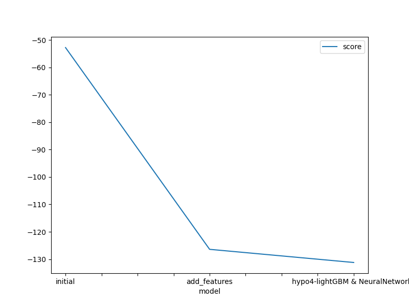
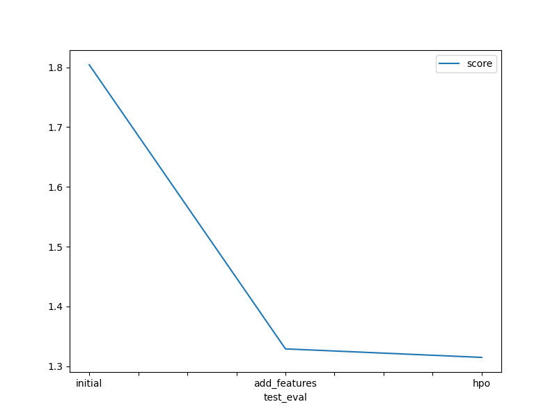

# Report: Predict Bike Sharing Demand with AutoGluon Solution
#### NAME HERE
Mohammad Abdullah

## Initial Training
### What did you realize when you tried to submit your predictions? What changes were needed to the output of the predictor to submit your results?
there must be some automate way to ignore the prediction which are negitive

### What was the top ranked model that performed?
The top rank model is WeightedEnsemble_L2 which was trained more feature and hyperparameter tuning. The kaggle RMSE score of the top rank model was  1.32607 

## Exploratory data analysis and feature creation
### What did the exploratory analysis find and how did you add additional features?
in exploratory data analysis i have found that datetime column are not in its orginal required form and the season columns is not it its accurate datatype so i have added the year month and day more features in the dataset and changed the datatype of season column

### How much better did your model preform after adding additional features and why do you think that is?
My model performed better after adding additional features. The Kaggle score of root_mean_square_error (RMSE) was decrease to a better result of 1.34242 from 1.79883. I think it is because additional features and categorized data help the model for better learning the related patterns between the feature and the target.

## Hyper parameter tuning
### How much better did your model preform after trying different hyper parameters?
yes i have tried different hyperparameters and i get best result of 1.3267 score of kaggle it is little bit improved from the one without hyperparameters
### If you were given more time with this dataset, where do you think you would spend more time?
i will spend time in fining the best hyperparameter and the make my data best to get good outcome 

### Create a table with the models you ran, the hyperparameters modified, and the kaggle score.
|model|hpo1|hpo2|hpo3|score|
|--|--|--|--|--|
|initial|1000|1000|1000|-76.933|
|add_features|10000|10000|10000|-88.869|
|hpo|1000|10000|10000|-97.359|

### Create a line plot showing the top model score for the three (or more) training runs during the project.

### Create a line plot showing the top kaggle score for the three (or more) prediction submissions during the project.

## Summary
i have tried alot to make my model best but i haven't find the best hyperparameter required by this model.
